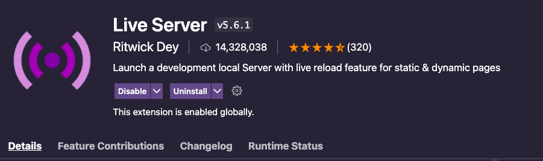

# Algorithm-function-Practice

a collection of Algorithm Function challenges to sharpen your skills and help you get prepared for technical interviews. 

## Instructions

-  each challenge contains an **Unsolved/Solved folder**. 
-  Start by opening a challenge and navigate to the `Unsolved/folder` 
-  Follow the instructions located in **readMe.md** editor 

## Solutions/Testing

- You can check to see if your function works properly by opening [Unsolved/test.html](Unsolved/test.html) in your web browser.

  - Functions that _pass_ the tests will be denoted with a **green check mark**.

  - Functions that _fail_ the tests will be denoted with a **red x and an error message**.
 ###### **minor note**  
- these functions use the `var` declaration. these will still work fine if you choose to use `const/let` respectively.
- keep in mind that **`var`** is function scoped and **`let`** is block scoped.  🙂 

- any challenges or features that you want to add feel free to submit a pull request 

## Recommended 
 - I highly recommend checking out the
 
  

extension 

- Live Server enables the HTML page to reload automatically after changes to files. which greatly accelerates testing your functions and building with HTML, CSS, and vanilla JavaScript . 

